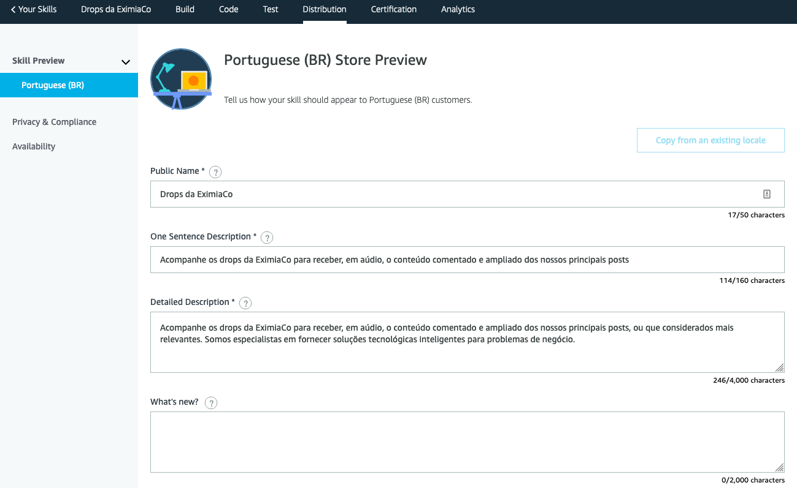
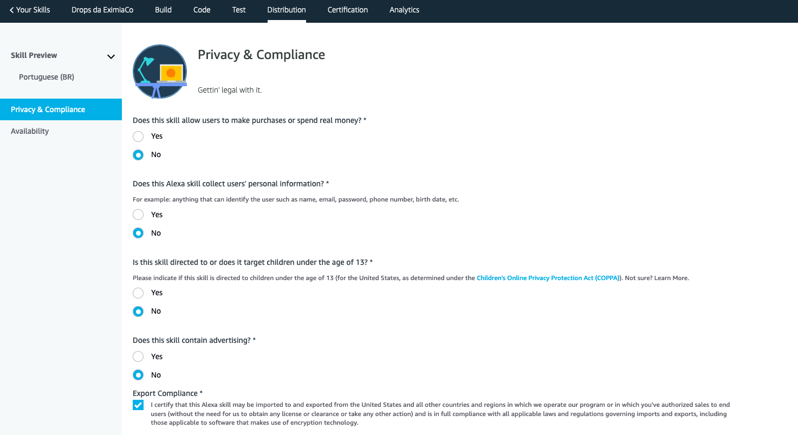
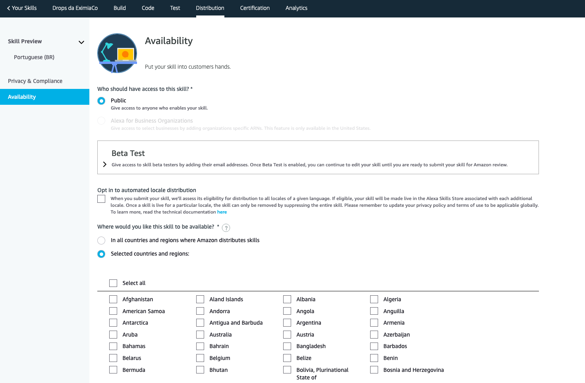

# Publicando a skill da EximiaCo no Marketplace da Alexa

Durante o processo de desenvolvimento, a *skill* é disponibilizada no *marketplace* da conta utilizada para desenvolvê-la, possibilitando testes e até a execução a longo prazo. **Entretanto, este *post*, que é o ultimo da [série](https://www.eximiaco.tech/pt/serie/criando-uma-skill-para-a-amazon-alexa/), irá apresentar os dois passos finais necessários para disponibilizar a nossa *skill* publicamente.**

**O primeiro deles é preencher os dados para a distribuição da *skill*. Nele devem ser informados os dados básicos que serão utilizados no *marketplace*, como o nome, a descrição, um exemplo de invocação e as imagens.**

Também são solicitadas informações de privacidade e disponibilidade, permitindo a escolha dos países onde a *skill* estará disponível, e se a distribução será um teste Beta, informando quais são as contas da Alexa (e-mails) das pessoas que terão acesso antecipado.

**O segundo passo, é submeter a *skill* para certificação. Nesta etapa é possível efetuar uma verificação de todas as configurações para identificar se alguma informação necessária esta incorreta ou faltando. Em seguida, na publicação, é possível optar por publicá-la automaticamente após a certificação, em caso de sucesso, ou ainda optar por publicar em um segundo momento.**

Durante a certificação, o time da Alexa irá avaliar a execução como se fossem usuários finais, seguindo a orientação das respostas da *skill* para cada operação. Caso eles enfrentem problemas na execução ou identificarem que a *skill* não está respondendo de forma amigável o suficiente, eles a reprovam, enviando um e-mail com os pontos a serem melhorados. 

A *skill* da EximiaCo precisou ser revisada durante o processo de publicação, principalmente por que a resposta à invocação estava deficiente de contexto. Contudo, seguindo as diretrizes enviadas no e-mail de resposta da primeira certificação, foi extremamente fácil resolver.

O processo de certificação aconteceu muito rapidamente. Depois de submeter a *skill*, a resposta veio um ou dois dias depois, e, após publicada, ela estava disponível algumas horas mais tarde.

Para quem ainda não conhece a *skill* dos *Drops* da EximiaCo, ela já está disponível no *[marketplace da Alexa](https://www.amazon.com.br/Douglas-Picolotto-Drops-da-EximiaCo/dp/B087QV63BF)*. E para quem quiser contribuir, a skill está no *[Github](https://github.com/eximiaco/drops-alexa-skill)* e é totalmente *Open Source*.