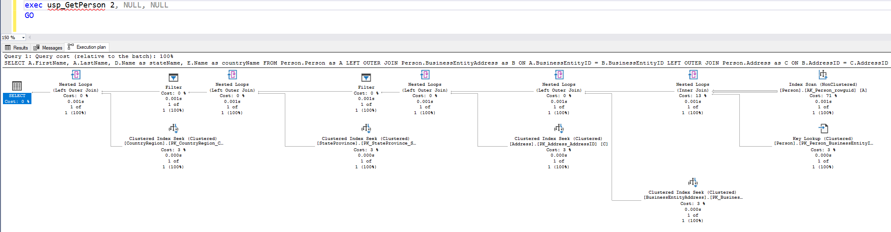
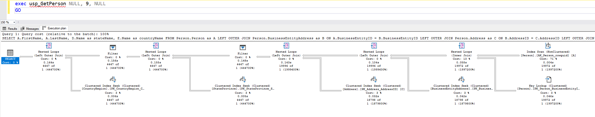
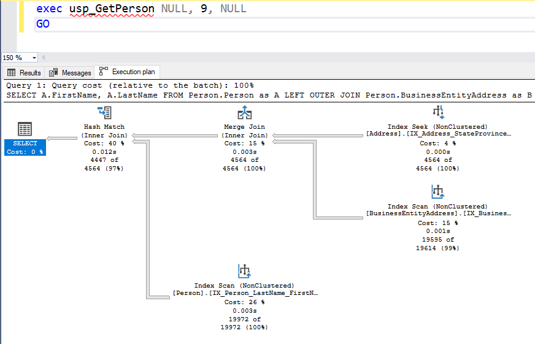

# OTIMIZANDO STORED PROCEDURES

**Há algum tempo, por ingenuidade, alguns programadores assumem que usar *stored procedures* é uma coisa ruim. Muitos assumem que há risco de “vazar” o domínio do código aplicação para o banco de dados. Entretanto, quando isso ocorre, a causa é o abuso da tecnologia e não da tecnologia em si.**

Utilizar *stored procedures* para consultar o banco de dados tem uma série de benefícios comparado com consultas *ad hoc*: são mais rápidas, reduzem o tráfego na rede, são mais seguras e podem encapsular código reutilizável. Além de tudo isso, são armazenadas já pré-compiladas pelo *SQL Server*.

Toda vez que uma consulta é submetida ao *SQL Server*, ela precisa ser interpretada (*query parser* e *algebrizer*), otimizada (*optimizer*) e, finalmente, executada. Se forem *stored procedures*, porém, a interpretação e otimização já ocorrem na primeira execução, nas demais, a execução passa a ser de maneira direta. Entretanto, é necessário estar atento para identificar se o banco “entende” a consulta da forma adequada.

Considere a seguinte *stored procedure* para a base *[AdventureWorks2019](https://docs.microsoft.com/pt-br/sql/samples/adventureworks-install-configure?view=sql-server-ver15&tabs=ssms)*.

```
CREATE OR ALTER PROCEDURE dbo.usp_GetPerson 
( 
    @BusinessEntityID	INT = NULL, 
    @StateProvinceID	INT = NULL, 
    @CountryRegionCode	NVARCHAR(3) = NULL 
) 
AS 
BEGIN
	
	SET NOCOUNT ON

	SELECT
		A.FirstName,
		A.LastName
	 FROM Person.Person as A
	 LEFT OUTER JOIN Person.BusinessEntityAddress as B
	   ON A.BusinessEntityID = B.BusinessEntityID
	 LEFT OUTER JOIN Person.Address as C
	   ON B.AddressID = C.AddressID 
	 LEFT OUTER JOIN Person.StateProvince as D
	   ON C.StateProvinceID = D.StateProvinceID 
	 LEFT OUTER JOIN Person.CountryRegion as E
	   ON D.CountryRegionCode = E.CountryRegionCode
	WHERE (@BusinessEntityID IS NULL OR A.BusinessEntityID = @BusinessEntityID) 
	  AND (@StateProvinceID IS NULL OR C.StateProvinceID = @StateProvinceID) 
	  AND (@CountryRegionCode IS NULL OR D.CountryRegionCode = @CountryRegionCode)

END
```


> ## Evite o prefixo 'sp_' para nomes de stored procedures
>Ao criar *stored procedures*, evite utilizar o padrão *sp_\<nome da procedure\>* ao nomeá-las. Esse padrão de nomenclatura é utilizado pelo *SQL Server* para as *procedures* de sistema, e faz com que ele procure se a *procedure* existe antes no banco *Master* e somente depois no banco atual.
>
>Utilizar outra nomenclatura evita a primeira busca desnecessária, um pequeno ganho de performance.

Essa *procedure* irá retornar um ou mais registros filtrando com base num conjunto diverso de parâmetros opcionais.

É muito comum encontrar esse padrão de escrita de *procedures* para resolver consultas que podem ter vários parâmetros opcionais como possíveis filtros. Infelizmente, apesar desse código ser de escrita rápida e prática, existem alguns problemas nessa abordagem que ficam evidentes na análise do plano de execução para uma consulta simples:



 
 **Na imagem, o primeiro ponto de atenção é a complexidade do plano de execução determinado pelo *SQL Server***. A consulta proposta é simples (buscar a pessoa cujo *BusinessEntityID* = 2). Repare que, mesmo não utilizando as tabelas de endereço é efetuada a junção com elas. Outro aspecto importante é que o *Optimizer* dispensou o melhor índice efetuando um *index scan* no índice *AK_person_rowguid* ao invés de um *index seek* no índice *PK_Person_BusinessEntityID*.


**Mas o que acontece se alterarmos os parâmetros passados para a procedure?**



Na imagem acima, constata-se que o mesmo plano de execução foi reutilizado, mesmo com parâmetros que levam a uma consulta diferente. Trata-se de um problema bem conhecido: ***Parameter Sniffing***. [Para quem não sabe o que faz, um benefício de uma ferramenta converte-se, rapidamente, em um pesadelo.](https://twitter.com/intent/tweet?text=Para%20quem%20n%C3%A3o%20sabe%20o%20que%20faz,%20um%20benef%C3%ADcio%20de%20uma%20ferramenta%20converte-se,%20rapidamente,%20em%20um%20pesadelo.%20&url=https://www.eximiaco.tech/?p=3884&via=eximiaco)

> ## *Parameter Sniffing*
>Quando a procedure é compilada, o valor do parâmetro é avaliado na criação do plano de execução que será armazenado no cache de planos. Uma vez que o processo de compilar consultas é oneroso, o *SQL Server*, sempre que possível, tenta reutilizar os planos de execução já criados. O problema ocorre quando o resultado das consultas difere muito e foi reutilizado o plano de execução da consulta mais simples (que foi executada primeiro), para resolver a consulta mais complexa (executada posteriormente), e assim acaba optando por um plano não ótimo. Esse é um comportamento normal do banco de dados quando você está utilizando parâmetros nas suas stored procedures.

Existem algumas soluções paleativas para resolver o problema em questão quando o mesmo estiver ocorrendo em produção e não se tem muito tempo para apagar o incêndio no servidor. A mais simples delas é identificar o plano de execução que está no cache e utilizar o comando **DBCC FREEPROCCACHE \<PLANO DE EXECUÇÃO\>** para removê-lo, forçando com isso que na próxima execução da procedure monte um plano de execução melhor. É preciso ter cuidado pois caso seja executado essa instrução sem informar parâmetros, irá remover TODOS os planos de execução do seu cache de planos, fazendo o *SQL Server* ter mais trabalho para recompilar os mesmos, quando as consultas forem executadas novamente. Isso consome bastante recursos do servidor.

```
DBCC FREEPROCCACHE (0x060006000C99302500499EFC8801000001000000000000000000000000000000000000000000000000000000);
```

>Uma ferramenta que pode ajudar a encontrar qual plano de execução precisa ser removido é executar a [*sp_BlitzCache*](https://www.brentozar.com/blitzcache/), desenvolvida por Brent Ozar e disponível para download gratuito em seu site. Nos resultados da *procedure* tem uma coluna exatamente com o comando para remoção do plano de execução do cache

Outra possível solução para o problema em questão, é ao final da instrução *select* da sua *procedure* utilizar a opção *OPTION (RECOMPILE)*. Embora essa solução resolva o problema de forma mais persistente e efetiva do que a remoção do plano do cache, irá fazer com que o *SQL Server* descarte qualquer plano de execução salvo para a consulta e crie um novo plano de execução sempre que a *procedure* for chamada, podendo ocasionar um consumo alto de recursos no seu servidor, caso a mesma seja executada com frequência, ou essa técnica também seja utilizada em várias outras procedures.

```
CREATE OR ALTER PROCEDURE dbo.usp_GetPerson
( 
    @BusinessEntityID  INT = NULL,
    @StateProvinceID   INT = NULL,
    @CountryRegionCode NVARCHAR(3) = NULL
)
AS
BEGIN

	SET NOCOUNT ON 

	SELECT
		A.FirstName, 
		A.LastName
	 FROM Person.Person as A 
	 LEFT OUTER JOIN Person.BusinessEntityAddress as B 
       ON A.BusinessEntityID = B.BusinessEntityID 
	 LEFT OUTER JOIN Person.Address as C 
	   ON B.AddressID = C.AddressID 
	 LEFT OUTER JOIN Person.StateProvince as D 
	   ON C.StateProvinceID = D.StateProvinceID 
	 LEFT OUTER JOIN Person.CountryRegion as E 
	   ON D.CountryRegionCode = E.CountryRegionCode 
	WHERE (@BusinessEntityID IS NULL OR A.BusinessEntityID = @BusinessEntityID) 
	  AND (@StateProvinceID IS NULL OR C.StateProvinceID = @StateProvinceID) 
	  AND (@CountryRegionCode IS NULL OR D.CountryRegionCode = @CountryRegionCode) 
	OPTION (RECOMPILE)

END 
```


Ao chamar novamente a procedure um plano de execução mais performático foi escolhido:




## **Usando *Dynamic SQL* para otimizar suas *Stored Procedures***

*Dynamic SQL* são consultas que são construídas sob demanda antes de serem executadas, sendo que o funcionamento da consulta pode variar de acordo com os parâmetros de entrada. Apesar da escrita ser mais trabalhosa (e um pouco menos legível), utilizar *dynamic SQL* para implementar a *procedure* acima, pode resolver os problemas de otimização de código e *parameter sniffing* de uma forma permanente e mais eficaz.

```
CREATE   PROCEDURE [dbo].[usp_GetPersonOptimized]
(
	@BusinessEntityID	INT = NULL,
	@StateProvinceID	INT = NULL,
	@CountryRegionCode	NVARCHAR(3) = NULL
)
AS
BEGIN

	SET NOCOUNT ON

	declare @query nvarchar(max) = '
	SELECT
		A.FirstName,
		A.LastName
	FROM Person.Person as A ' +
	IIF(@StateProvinceID IS NULL AND @CountryRegionCode IS NULL, '', '
	INNER JOIN Person.BusinessEntityAddress as B ON A.BusinessEntityID = B.BusinessEntityID 
	INNER JOIN Person.Address as C ON B.AddressID = C.AddressID
	INNER JOIN Person.StateProvince as D ON C.StateProvinceID = D.StateProvinceID ') +
	IIF(@CountryRegionCode IS NULL, '', '
	INNER JOIN Person.CountryRegion as E ON D.CountryRegionCode = E.CountryRegionCode ') + '
	WHERE 1 = 1 ' +
	IIF (@BusinessEntityID IS NULL, '', '
	  AND A.BusinessEntityID = @BusinessEntityID ') +
	IIF (@StateProvinceID IS NULL, '', '
	  AND C.StateProvinceID = @StateProvinceID ') +
	IIF (@CountryRegionCode IS NULL, '', '
	  AND D.CountryRegionCode = @CountryRegionCode ')

	EXEC sp_executesql
		@stmt			= @query,
		@params			= N'@BusinessEntityID INT, @StateProvinceID INT, @CountryRegionCode NVARCHAR(3)',
		@BusinessEntityID	= @BusinessEntityID,				
		@StateProvinceID	= @StateProvinceID,					
		@CountryRegionCode	= @CountryRegionCode

END
GO
```

>O uso do filtro *WHERE* 1 = 1, é apenas um facilitador para a escrita dos demais filtros da consulta. Dessa forma não se faz necessário ficar testando se a cláusula *WHERE* já foi adicionada anteriormente a consulta a cada concatenção dos demais filtros, deixando seu código mais limpo. Na hora de avaliar os predicados da consulta o compilador ignora esse filtro ao montar o plano de execução.


Existem diversas vantagens em escrever *dynamic SQL* nas *procedures* dessa forma: 

- Monta o plano de execução ótimo de acordo com os parâmetros passados.
- O uso da ***sp_executesql*** faz com que o plano de execução seja colocado em cache e reutilizado pelo *SQL Server* posteriormente, sempre que uma consulta semelhante vier a ser executada.
- Faz com que somente os objetos realmente necessários pela sua consulta sejam utilizados, otimizando a performance dela.
- Com a alteração da *procedure* foi possível trocar o ***LEFT OUTER JOIN*** por ***INNER JOIN***, outro pequeno ganho de performance.
- Evita ***sql injection*** visto que os parâmetros da sua *procedure* são repassados como parâmetros também para sua consulta dinâmica.

Ao efetuar a chamada da *procedure* simultaneamente, porém passando parâmetros diferentes, nota-se que os planos de execução mudaram para cada caso, tendo o *SQL Server* optado pelo plano ideal para ambos casos:


Existe, porém, uma desvantagem ao utilizar essa abordagem de *dynamic SQL*. Para cada plano de execução diferente que a *procedure* criar de acordo com os parâmetros passados, eventualmente poderão ser criados muitos planos de execução que serão armazenados no cache de planos para essa mesma *stored procedure*. Entretanto o ganho de performance com essa solução irá mais que compensar por isso.


## EM RESUMO

**O FATO**

Utilizar *stored procedures* para acessar seus dados no *SQL Server* é a forma mais rápida e segura, além de proporcionar a reutilização do código e redução do tráfego na rede. Porém é preciso entender como o *SQL Server* trabalha com *procedures* parametrizadas, para que o código não venha a apresentar problemas futuros de performance quando seus dados não são distribuídos de forma semelhante, ocasionando eventuais gargalos no seu servidor de banco de dados.

**O INSIGHT**

Com algumas alterações na forma da escrita das *stored procedures*, é possível otimizarmos nosso código para evitar problemas que podem vir a acontecer, por debaixo dos panos, nos ambientes de produção cujo a solução nem sempre é trivial e perceptível. Além disso, podemos escrever códigos “genéricos”, mas com ganhos de performance apenas utilizando somente o que é realmente necessário para resolver as consultas.