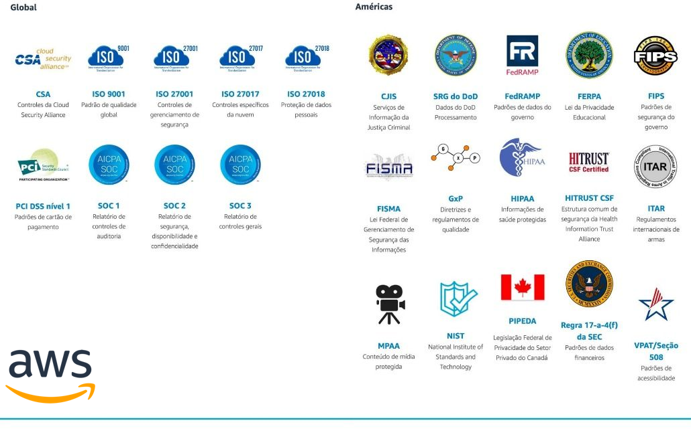
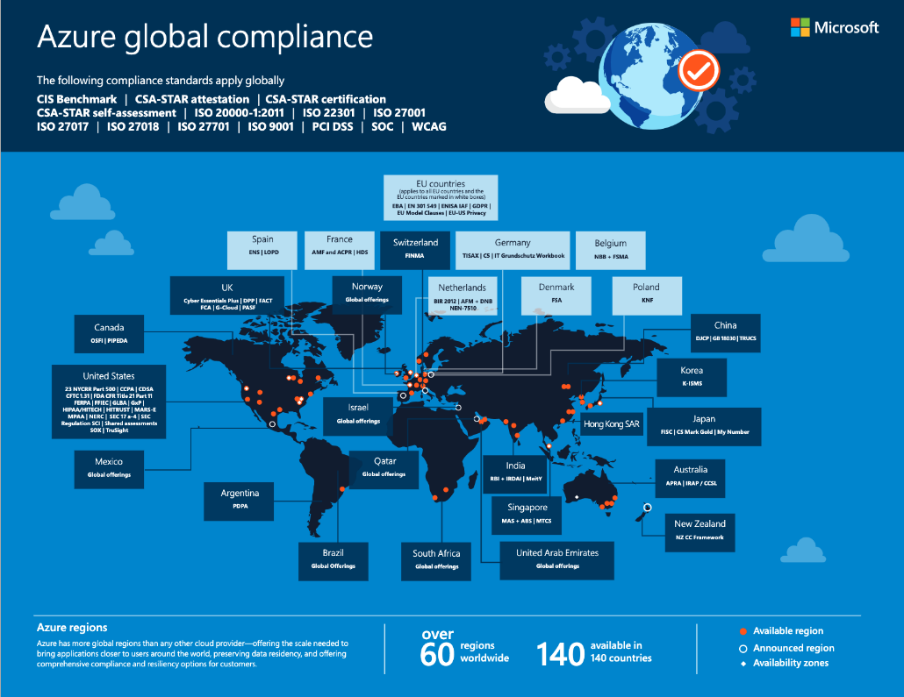
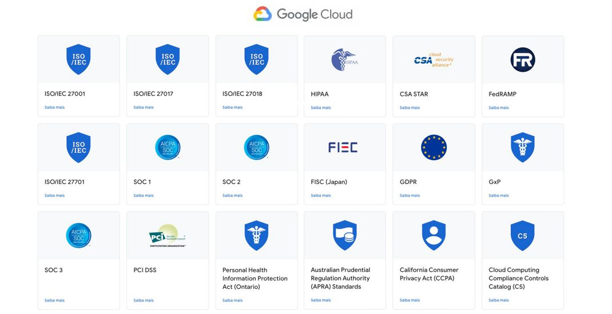

# Se segurança é sua maior preocupação, entenda porque você deveria migrar para a nuvem

Ainda é comum encontrar empresas no mercado que evitam migrar suas cargas de trabalho para a nuvem, por sentirem-se inseguras ao delegar o armazenamento dos seus dados para um terceiro. Essa desconfiança geralmente é fundamentada pela percepção de que, se os dados estão dentro de casa (*on-premise*), é mais difícil que os mesmos sejam acessados de forma indevida. Uma analogia similar é guardar dinheiro sob o colchão, por não confiar no sistema bancário.

Entretanto, na maioria das vezes, os argumentos que sustentam esta afirmação são bastante superficiais, deixando de considerar alguns aspectos fundamentais para uma conclusão mais precisa.

***

**Um aspecto bastante importante nesta avaliação, é que a responsabilidade de um ambiente de nuvem é compartilhada entre o provedor, que fornece a segurança "da" nuvem, e o cliente, que é responsável pela segurança "na" nuvem. Na prática, o provedor é responsável pela segurança dos produtos e serviços que ele oferece e o cliente é responsável pela segurança dos recursos que ele utiliza do provedor.**

A grande vantagem deste modelo, é que ao adotar um provedor de nuvem, o cliente estará recebendo, de forma indireta, todos os cuidados que o provedor tem ao manter seus data centers, através de times especializados, equipes de segurança e procedimentos rigorosos. Uma das formas de validar a aplicação destas práticas de segurança é avaliar as certificações dos provedores:

\
  *Algumas certificações da AWS*

***

\
*Compliance do Microsoft Azure*

***

\
*Algumas certificações do Google Cloud*

Certificações como a *[PCI-DSS](https://pt.pcisecuritystandards.org/)*, exigem processos bastante rigorosos afim de serem conquistados. O custo e o esforço para garantir toda esta estrutura em um ambiente *on-premise*, em muitas empresas, é bastante elevado e muitas vezes inviável. Na nuvem, este escopo é reduzido através das certificações que o provedor já possui, e isso acaba tornando-se transparente para os clientes.

Neste ponto, é importante reforçar também que, assim como o cliente, o provedor precisa garantir a segurança de suas instalações, afim de manter a confiabilidade e a saúde do seu negócio.

***

**Em segundo lugar, para auxiliar a manter o ambiente de seus clientes seguro, os provedores de nuvem fornecem serviços especialistas de segurança em diversos níveis.** Na *[AWS](https://aws.amazon.com)*, por exemplo, o *[Amazon GuardDuty](https://aws.amazon.com/pt/guardduty/)* é um serviço que analisa logs de diversas fontes, e aplica algoritmos de inteligência artificial para identificar qualquer anomalia, possibilitando a mitigação da ameaça de forma proativa e autonoma. No *[Microsoft Azure](https://azure.microsoft.com)*, o *[Azure Sentinel](https://azure.microsoft.com/pt-br/services/azure-sentinel/)* é um *[SIEM](https://pt.wikipedia.org/wiki/Gerenciamento_e_Correla%C3%A7%C3%A3o_de_Eventos_de_Seguran%C3%A7a)*, que analisa logs e eventos utilizando *Machine Learning*, permitindo a identificação e o tratamento de ameaças em tempo real. Já no Google Cloud, o *[Cloud Security Command Center](https://cloud.google.com/security-command-center)*, auxilia na detecção e mitigação de ameaças.

***

**É importante lembrar também, que segurança, de forma mais ampla, não trata apenas de acesso indevido aos dados, mas também da sua durabilidade. Da mesma forma como "vazar" informações confidenciais, perder informações importantes também pode comprometer todo o negócio.**

Provedores de nuvem fornecem serviços com alta durabilidade "*by design*". O *[Amazon S3](https://aws.amazon.com/pt/s3/)*, o [Google Cloud Storage](https://cloud.google.com/storage) e o *[Azure Storage](https://azure.microsoft.com/pt-br/services/storage/)*, por exemplo, oferecem "99,999999999%" (11 9's) de durabilidade. Isso significa que para 10 Milhões de objetos armazenados, estes serviços garantem que apenas 1 objeto será perdido a cada 10.000 anos, ou seja, são praticamente vitalícios. 

Dependendo do modelo de negócio, segurança é uma necessidade. Provedores de nuvem proporcionam recursos e infraestrutura em seus datacenters que seriam dificeis de estabelecer e manter em um ambiente on-premise. Por este motivo, a adoção de nuvem é essencial para manter um ambiente seguro.
